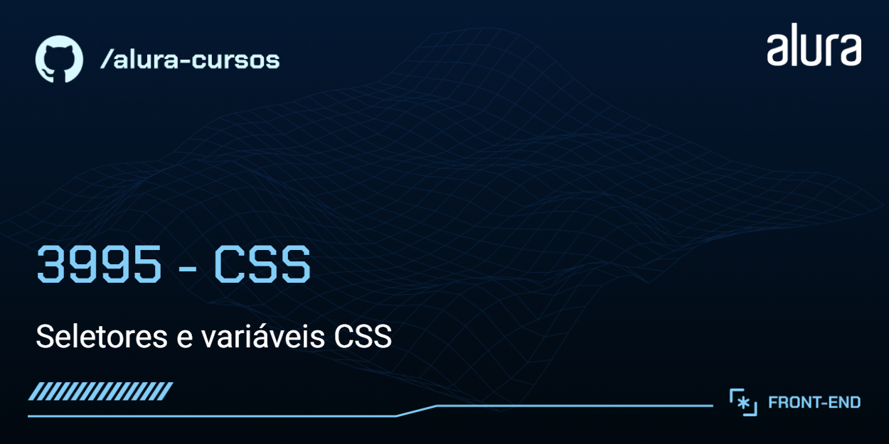

## Curso Alura
Aluro: Marcos Pelaez.

# Pet Park

Conheça o PetPark: o destino ideal para os cuidados do seu pet! Oferecemos serviços completos, desde banho e tosa até adestramento, com profissionais dedicados ao bem-estar dos animais. Em breve, traremos novidades imperdíveis para tornar sua experiência ainda melhor!

## 🔨 Funcionalidades do projeto

Neste estágio de desenvolvimento, o site possui as seguintes funcionalidades:

- Página estática com os principais planos, ofertas, serviços e parceitos

O [Figma dessa aplicação você encontra aqui](https://www.figma.com/design/nN4dJfqtIAFmY2TpC4Vwx8/Petpark-%7C-CSS-seletores-avan%C3%A7ados?node-id=127-2472&t=d5Qjt4b46aSi76KF-0).

## ✔️ Técnicas e tecnologias utilizadas

O projeto utiliza as seguintes tecnologias e bibliotecas:

- `HTML` - Para estrutura e marcação dos elementos da página
- `CSS` - Para criação de folhas de estilo em cascata
- `Figma` - Para prototipagem do projeto

E muito mais...

## 🛠️ Abrir e rodar o projeto

Para executar o projeto em seu ambiente local, siga estas etapas:

1. Baixe o repositório do projeto.

1. Extraia os arquivos para uma pasta de sua preferência.

4. Navegue até a pasta em questão

5. Abra o arquivo index.html no seu navegador, iniciando assim o projeto localmente

## 📚 Mais informações do curso

Gostou do projeto e quer conhecer mais?

O design e protótipo deste projeto podem ser encontrados [aqui](https://www.figma.com/design/nN4dJfqtIAFmY2TpC4Vwx8/Petpark-%7C-CSS-seletores-avan%C3%A7ados?node-id=127-2472&t=d5Qjt4b46aSi76KF-0). 

Aproveite o desenvolvimento e aprimoramento do site do Pet park!
